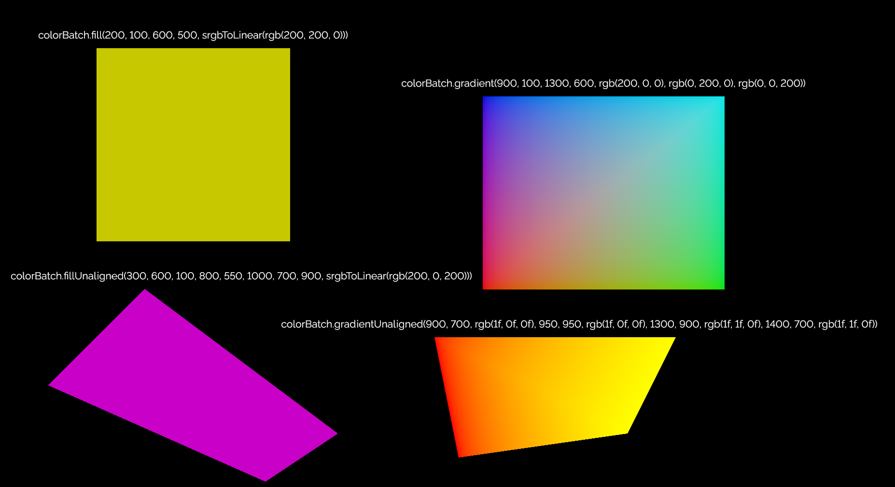

# The color pipeline
The color pipeline can be used to fill quads or rectangles with a 'flat' color, or to draw gradient rectangles/quads.
This is the simplest pipeline of `vk2d`.

## Setting up
To enable the color pipeline, the `config.color` field must be set to `true`:
```java
@Override
protected void setupConfig(Vk2dConfig config) {
	config.color = true;
}
```

## Creating a batch
Use `pipelines.color.createBatch(stage, batchCapacity)` to create an instance of `Vk2dColorBatch`.
- For single-stage rendering, the `stage` parameter should be `frame.swapchainStage`.
- See the [README](../../README.md) for instructions on choosing the right batch size/capacity.
All color drawing operations will occupy 2 triangles.

## Defining colors
Note that you can use e.g. `ColorPacker.rgb(red, green, blue)` to define the colors.
If you use a color picker from e.g. Paint or GIMP to choose your colors, you should also wrap each color with
`ColorPacker.srgbToLinear` to get the expected result.

## Drawing operations
The color pipeline supports 4 drawing methods: `fill`, `gradient`, `fillUnaligned`, and `gradientUnaligned`.
Their details can be found in their doc comments, and they are demonstrated below:

