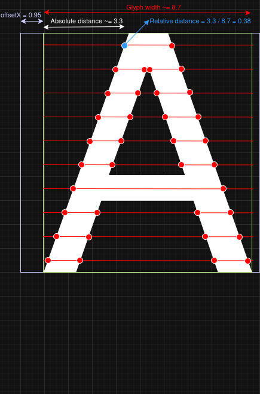

## Curve intersections
This whole text rendering technique is based on finding intersections between
curves and horizontal or vertical lines. To keep things simple, I will start
with just horizontal lines.

### Horizontal lines
Recall the 'A' to be rendered at `(5.0, 15.0)`, which was to be rendered
between `(5.95, 5.0)` and `(14.68, 15.0)`.

I will draw horizontal lines through the middle of all relevant pixels:

Furthermore, I compute the intersections:

For each intersection, the distance to the start (the left) of the horizontal
line is stored, and is divided by the length of the horizontal line, which is
the width of the glyph. So, all intersections should be numbers between 0.0 and
1.0. I will demonstrate it on one of the intersections:

For decent antialiasing, I also need the vertical intersections. To make the
example more interesting, I will use the 'g' instead of the 'A'.
