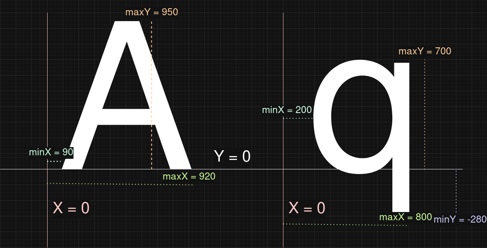

## Text and glyph sizes
Since every font has a different size, the traditional 'font size' measure is
not always very meaningful: if I draw a string with two fonts using the same
font size, their size (in pixels) can be completely different.

To work around this problem, I introduce the notion of *heightA*, which is
the height of the uppercase 'A' character. When I draw the string "AAA" with
two fonts using `heightA = 20 pixels`, the size of the drawn strings will be
(approximately) the same: both will be approximately 20 pixels high.

### Glyph bounding boxes
A glyph in a font is basically a list of curves
`(startPoint, controlPoint, endPoint)`, where the coordinate of every point is
expressed as integer, and the unit is 1/64th of a pixel. For each glyph, I
remember the smallest and largest X-coordinate and Y-coordinate that occurs
in at least one point in at least one curve. I use these coordinates to define
the bounding box of every glyph. Consider the following example glyphs:

The bounding box here is expressed in absolute coordinates, but such
coordinates are not very meaningful to me. For more convenient rendering, I
will express them as a multiple of the `maxY` of the uppercase 'A' character:

### Rendering glyphs at integer coordinates
Consider the case where I want to render the uppercase 'A' at position (5, 15)
using `heightA = 10` (pixels). Then I should render it between the following bounds:
- minX = 5 + 10 * 0.09 = 5.95
- minY = 15 - 10 * 1.0 = 5 (yeah, it's annoying negative Y goes up here)
- maxX = 5 + 10 * 0.96 = 14.68
- maxY = 15 - 10 * 0.0 = 15

Since I can't truly render to 'half' pixels, some rounding is needed:
- intMinX = floor(minX) = 5
- intMinY = floor(minY) = 5
- intMaxX = ceil(maxX) = 15
- intMaxY = ceil(maxY) = 15

For every pixel, the 'intensity' of the glyph at the *center* of the pixel is
used. Ignoring antialiasing, a pixel should be white if and only if its
*center* is inside the 'A' drawn at `(5.95, 5.0)`, otherwise it should be
black. The horribly aliased result is shown below:

It is clearly supposed to be an 'A', but aliased text at such a small
resolution looks horrible. Fortunately, my text rendering technique supports
anti-aliasing.
